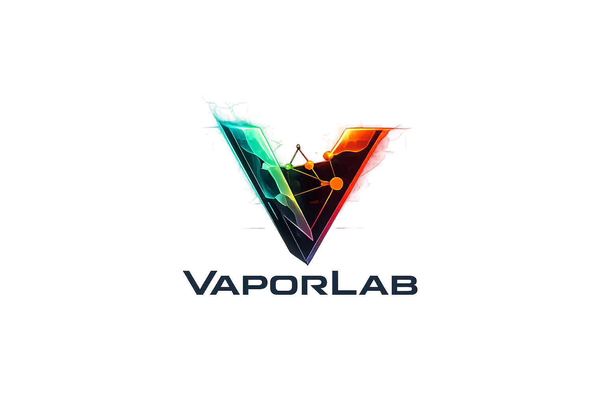

# VaporLab

VaporLab is an offensive API security lab that deliberately implements vulnerable and hardened modes to train red and blue teams on OWASP API Top 10 (2019 and 2023), AI/ML abuse paths, OIDC/OAuth misuse, exploit chaining, and now a professional operator frontend.

## Disclaimer
This project is intentionally vulnerable in default mode and must be deployed only in isolated lab environments.

## Repository Layout
- `cmd/` runtime entrypoints
- `pkg/` shared Go packages and vulnerable API implementation
- `frontend/` Next.js + Tailwind operator dashboard
- `services/` service boundaries and ownership notes
- `infra/` observability and infrastructure configuration
- `attack-scenarios/` reproducible attack automation
- `docs/` manuals, roadmap, runbooks, user guides
- `scripts/` QA and automation scripts

## Quick Start (Dev)
1. `docker-compose -f docker-compose.dev.yml up -d --build`
2. Frontend: `http://localhost:15100`
3. API health: `curl http://localhost:18080/healthz`
4. Run QA smoke tests: `bash scripts/qa_tests.sh http://localhost:18080`

## Non-Standard Host Ports
- Frontend: `15100` (dev), `25100` (qa), `35100` (prod)
- API: `18080` (dev), `28080` (qa), `38080` (prod)
- Full map: `docs/INFRA_OVERVIEW.md`

## Modes
- Vulnerable mode: `SECURE_MODE=false`
- Hardened mode: `SECURE_MODE=true`

## Documentation
- [Roadmap](docs/ROADMAP.md)
- [User Guide](docs/USER_GUIDE.md)
- [QA Runbook](docs/QA_RUNBOOK.md)
- [Manuals](docs/manuals/INDEX.md)
- [Dev Logs](docs/dev-logs/INDEX.md)

## License
Licensed under Apache-2.0. See [LICENSE](LICENSE).
